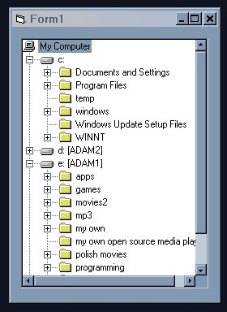



## Directory Tree ActiveX control code

### Description

*I`m sorry I forgot that the folder.bas was added from another project* My Humble apologies.

shows a directory tree view using treeView control

retriving the icon associated with the folder or drive
 
### More Info
 

             |
---                |---
**Submitted On**   |2002-03-11 22:54:10
**By**             |[Adam Bogucki](https://github.com/Planet-Source-Code/PSCIndex/blob/master/ByAuthor/adam-bogucki.md)
**Level**          |Advanced
**User Rating**    |5.0 (10 globes from 2 users)
**Compatibility**  |VB 5\.0, VB 6\.0
**Category**       |[Files/ File Controls/ Input/ Output](https://github.com/Planet-Source-Code/PSCIndex/blob/master/ByCategory/files-file-controls-input-output__1-3.md)
**World**          |[Visual Basic](https://github.com/Planet-Source-Code/PSCIndex/blob/master/ByWorld/visual-basic.md)
**Archive File**   |[Directory\_614613112002\.zip](https://github.com/Planet-Source-Code/adam-bogucki-directory-tree-activex-control-code__1-32592/archive/master.zip)

